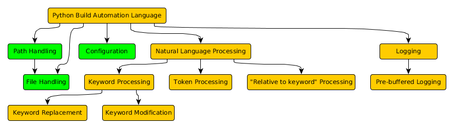
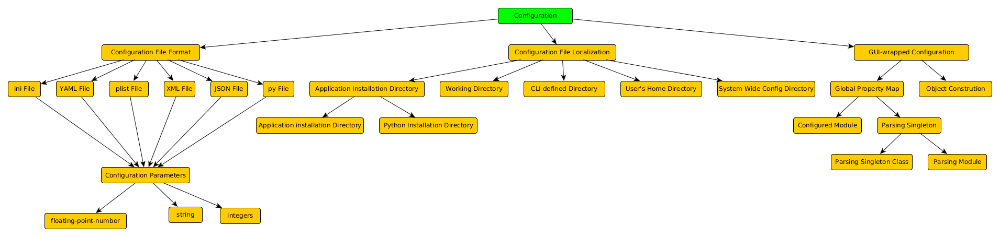
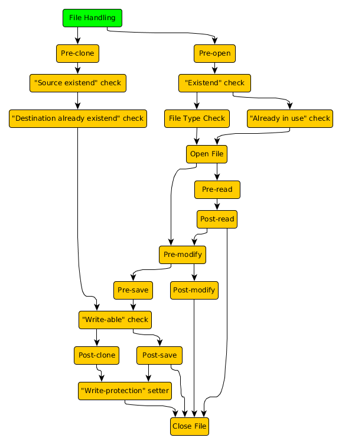
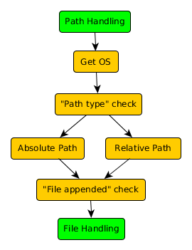

.. build_automation_pattern_language:

*********************************
Build Automation Pattern Language
*********************************

1st level patterns
==================

2nd level patterns
==================

